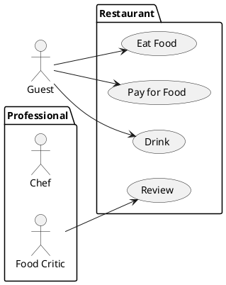

# 🏢 Bienvenido a la Documentación de Geotec

**Geotec** es una empresa especializada en el desarrollo de soluciones de software personalizadas. Nos enfocamos en sistemas como **AVALUOS**, **ERP**, entre otros proyectos innovadores diseñados para optimizar la gestión y los procesos empresariales de nuestros clientes.

Este portal tiene como objetivo proporcionar documentación clara, estructurada y siempre actualizada para facilitar el uso e implementación de nuestras soluciones tecnológicas.

---

## 📖 Contenido principal

- **Guías de Usuario**  
  Instrucciones paso a paso para el uso eficiente de nuestras plataformas.

- **Manuales Técnicos**  
  Información detallada sobre instalación, configuración, arquitectura y mantenimiento.

- **Preguntas Frecuentes (FAQ)**  
  Respuestas a las consultas más comunes.

- **Notas de Versión**  
  Registro de cambios, mejoras y nuevas funcionalidades en cada versión.

- **Soporte Técnico**  
  Canales de contacto para asistencia técnica o reporte de incidencias.

---

## Accesos rápidos

- [📘 Documentación de AVALUOS](./avaluos)
- [📗 Documentación de ERP](./erp)
- [📙 Otras Soluciones](./otros)
- [📞 Contacto y Soporte](./soporte)

---

## Últimas actualizaciones

- **AVALUOS v2.1.0** – Nueva funcionalidad de exportación de informes (Abril 2025)  
  → [Ver detalles](./avaluos/versiones)

- **ERP v4.3.2** – Corrección de errores y mejoras de rendimiento (Marzo 2025)  
  → [Ver detalles](./erp/versiones)
  
---

## Recomendaciones para nuevos usuarios

- Explora el menú lateral para navegar entre las secciones disponibles.
- Utiliza el buscador (🔍) para acceder rápidamente a la información que necesitas.
- Si estás comenzando, te sugerimos visitar nuestra [Guía de Inicio Rápido](./inicio-rapido).

---

> 💡 Esta wiki se actualiza de forma periódica para reflejar los cambios y mejoras de nuestros sistemas. Te invitamos a revisarla constantemente.

---

**© Geotec - Todos los derechos reservados**�

> eeeeeeeeeeeeeeeeeee

> ddddddddddddddddddd
{.is-info}

> ggggggggggggggggggg
{.is-success}

> ddddddddddddddddddd
{.is-warning}

> eeeeeeeeeeeeeeeeeee
{.is-danger}

```graphql
mutation {
  users {
    create (
      email: "john.doe@example.com"
      name: "John Doe"
      passwordRaw: "Password123"
      providerKey: "local"
      groups: [1]
      mustChangePassword: true
      sendWelcomeEmail: false
    ) {
      responseResult {
        succeeded
        slug
        message
      }
      user {
        id
      }
    }
  }
}

```

# Markdown

## Tabset {.tabset}

### Definition

Converts Markdown content into HTML.

## 🛒 Catálogo de Productos

<div style="text-align:center">
  
</div>

> Estos productos están disponibles por tiempo limitado.
{.is-warning}

| Producto | Precio | En stock |
|:--------:|-------:|:--------:|
| Pan      |  1.00  |   ✅     |
| Leche    |  1.50  |   ❌     |

<div style="text-align: center; color: green;">
  <strong>¡Esto también es válido!</strong>
</div>

<details>
<summary>¿Qué es GraphQL?</summary>

GraphQL es un lenguaje de consulta para APIs desarrollado por Facebook...

</details>

## Tabset {.tabset}

### Pestaña 1

Contenido

### Pestaña 2

Otro contenido

##



```diagram
PHN2ZyB4bWxucz0iaHR0cDovL3d3dy53My5vcmcvMjAwMC9zdmciIHN0eWxlPSJiYWNrZ3JvdW5kOiB0cmFuc3BhcmVudDsgYmFja2dyb3VuZC1jb2xvcjogdHJhbnNwYXJlbnQ7IGNvbG9yLXNjaGVtZTogbGlnaHQgZGFyazsiIHhtbG5zOnhsaW5rPSJodHRwOi8vd3d3LnczLm9yZy8xOTk5L3hsaW5rIiB2ZXJzaW9uPSIxLjEiIHdpZHRoPSI1NjlweCIgaGVpZ2h0PSI0NTJweCIgdmlld0JveD0iLTAuNSAtMC41IDU2OSA0NTIiIGNvbnRlbnQ9IiZsdDtteGZpbGUgaG9zdD0mcXVvdDtlbWJlZC5kaWFncmFtcy5uZXQmcXVvdDsgYWdlbnQ9JnF1b3Q7TW96aWxsYS81LjAgKFdpbmRvd3MgTlQgMTAuMDsgV2luNjQ7IHg2NCkgQXBwbGVXZWJLaXQvNTM3LjM2IChLSFRNTCwgbGlrZSBHZWNrbykgQ2hyb21lLzEzNS4wLjAuMCBTYWZhcmkvNTM3LjM2JnF1b3Q7IHZlcnNpb249JnF1b3Q7MjYuMi4xMiZxdW90OyZndDsmbHQ7ZGlhZ3JhbSBpZD0mcXVvdDtIYVlCLXBoMkdKUEpUSUFQVFZjdiZxdW90OyBuYW1lPSZxdW90O1DDoWdpbmEtMSZxdW90OyZndDs3VnR0YitJNEVQNDFTTHNmV3NVeEFmb1IwbTd2cE81ZHRmVHVQcHZFQkt0T2pCeW50UHZyYjV3NEljRzhCRXE1SG91RVZEd1p2ejR6NDVtSHRJUDkrUFZla3Zuc3V3Z3A3N2hPK05yQnR4M1hSVTYzQzMrMDVLMlFlRDFVQ0NMSlFxTzBGSXpaVDFyMk5OS01oVFJ0S0NvaHVHTHpwakFRU1VJRDFaQVJLY1dpcVRZVnZEbnJuRVRVRW93RHdtM3BQeXhVczBJNmNQdEwrVytVUmJOeVp0UzdLWjVNU1BBY1NaRWxacjVFSkxSNEVwTnlHTFBIZEVaQ3NhaUo4RjBIKzFJSVZYeUxYMzNLOWJHV0oxYjArN2JoYWJWa1NSUFZwZ011T3J3UW5wbGRqMW1xYUV6RzJaekttTW9BMXRlcFZxdmV5c05KRnl6bUJQYUZSMU9ScUxGNUFoc1lFYzZpQkw0SHNBWXFRZkJDcFdKd3JrUHpRSWs1U0lNWjQrRURlUk9aWG1tcTROREsxbWdtSlBzSnd4SU9qeEFJNExGVXhrVGNYa05qckh1QzJBR3BwQ25vUEpiYlI1WG9nYVRLNkFTQ2N6SlAyU1Jmc0ZhSmlZeFlNaEpLaWJnY1NLTkhROU9xVU1vYlNvcm55aUowZi92UURRNTY0L1MxSmpJZzNGTVJVeVhmUUtYeUZuUEVwYStZNW1KcGVHNnBNcXNiSFRaQ1lvdzlxb2F1WnZzQnprR1NDTFpiVGVmaTVuU29hOCtIZW12bWc3TnZURWM0UUp3UVJVZjZ3Tks2cmNHWDJrNlhvdHdDMTF0ajE3SkdTU093UjBta3o1azJweTlmTzNpb1ZRVDAwWXZCcU1EZHFEMUs4VUpwS0dRTHhUQUxsTmlsNThQZUlyQTFza0Z4eWhLdzk1K2dLT0s1M0tURkVoWXdJc2RnaXlMNWtxVVprVXdVbW44VmphK1doNEhscUpvM2NUcFZHMzBwblpPQUpkRkRyblBiWFVwK0dPaTBDRTVHVG5sdXh6TVdoalRKN1Z3UlJRcFgwQXVkQzVhb0hGdHZCQit3QU4rNTlqb2VMTWlITmxxMjRhUFZwZkpGb2srSzViWlB3YzhXVlB2YUdxL0FyYjNpcldsdHU3emdwcnZaQ1JybXVNWDJQRHNTcWl6VWEyOForcHhMNkRzczlMbk5XSVI3TFdNUndvTkRZaDlhaVgxNDhDbGlYMit6L1RsL1pQRUV6T244STRUWDJuZzJSNGhXMkIwU0lmb1dRa05ZcUU0aVhlYzdrYzluaDgrV1NEQlRNVGRmajRDaTU1NE94WUdGb29VYlozbHdOM3RFYXdQZkRsQmpnRWNQVjZMNHBFRyt2VUlXMHRoR0dxOUJsWk1KNVk4aVpRb1NDSkRKUW5jRjdSTTRYSC9RRHFvdG9ia3RVamNXVXI5RGtIWHU0SWp6Rzh4MW5uUnBjcGRJb2Z1ZG1mUFZVNHZ1RVlBYm5EQlNsaFY4RGJwN3FpK3lNWTBoWDVZYXhpZnlERWQ0YnFnZEFTaUVUaGdORWJLUXNqQ2hTVGpVZEFxMEpsem9oSE1FSXBPUjV1VU5OTDh4WGw0SU8xTEc1cTBTWlBLbGF0QXdvcVhOVXo0Umk3dWxZSlFMNEVGcEROdXl6MVJrTXFBTkFDQ0xqbWl6RU5IVGJVVmtIUUtTY3FMWVM1TWoycEtCUG1yanFsWGVLNFcrNitEbUVNWFNUYTg2YzdQdlFNV0dyWUVPU0UxTGc2d1pDWlRQVTVxbXdrNUtMOVhSVWFzanZGcXR0SzJPK2djUlE3amJvampxbjd3NFFtdDRTc0tKaVhYbmZZRlUzdmNwaXlKa2MzWVdKcjlRUHIwL1dHMXJueU1rMU1qbXVNN3RzaS9QLzdQYzltZ2xuUFlQdk8zeHlrQnVmMlV0Ujd6dGJTWnFHSVp3VzZhWHUvNWo3M3JQR1RSQXJwalJuWUVjYllua215OTd6MnNhMVNmNUZRalpSTnRZU1VwdEp2NE1ML3RlYTZQNUx5NTdtenp6bVRxL0pPeFE0bk4vOUU3SmZDS2JVSU93cWVnRnZvUGhhOHVHSGdNKzF5YlZJSUhWdDZQcitDSzh3SGc0ak1qcG5oQkhtM0x6WWFmcURJdlpFeUtJRDB4ZERrTFE1c01zNkg2bG1uZC90THlXU2NzUml0NDFyN2o5RFFjZm51UEZkeFJzZXFlTWhUWjc5R2VtNXBtdWZJZjZWNklIYmJNWG5OYmhkSFBLaUxjZmN5VG0rUW0rZ3h1cU9DYjBVVXlSQ1F0MW9xZ0VZU2RUWkFEU2NOZnI1NjZaNXAya1VjVzVWMGk3elNIYWtrWmVkOGRBRzBnamE2Q3IxVjhGVnNZUjAybEszOHM3clhrRHlybStMcEZiMmxuTzVkVDhja2NVbUJoR3A3aitSdFdyMmI3Z1FzTHovT1ZzdzE4Wmx0TmRhME9sRDVqWHpjMEtPc3U4dkRYUGMvVk9PeW5ON1NOQXNMbVg5Z2lVQ2NYL0FJTGplT3BWdituL0h3R0lUYmx3V0xDK0c4bEdRcXlXZGE1aVpTZDdiY2phS2hYZGp1QmVoR2w3dUMxWU4xbEErMGg5Y3h6OGNaT3dMY1BrZXl3QW1zdC8veWpVbC85ZWcrLytCUT09Jmx0Oy9kaWFncmFtJmd0OyZsdDsvbXhmaWxlJmd0OyI+PGRlZnM+PGNsaXBQYXRoIGlkPSJteC1jbGlwLTQtMzEtMTkyLTk0LTAiPjxyZWN0IHg9IjQiIHk9IjMxIiB3aWR0aD0iMTkyIiBoZWlnaHQ9Ijk0Ii8+PC9jbGlwUGF0aD48Y2xpcFBhdGggaWQ9Im14LWNsaXAtMjQtMzQxLTE1Mi0yNi0wIj48cmVjdCB4PSIyNCIgeT0iMzQxIiB3aWR0aD0iMTUyIiBoZWlnaHQ9IjI2Ii8+PC9jbGlwUGF0aD48Y2xpcFBhdGggaWQ9Im14LWNsaXAtMjQtMzY3LTE1Mi0yNi0wIj48cmVjdCB4PSIyNCIgeT0iMzY3IiB3aWR0aD0iMTUyIiBoZWlnaHQ9IjI2Ii8+PC9jbGlwUGF0aD48Y2xpcFBhdGggaWQ9Im14LWNsaXAtMjQtNDAxLTE1Mi0yNi0wIj48cmVjdCB4PSIyNCIgeT0iNDAxIiB3aWR0aD0iMTUyIiBoZWlnaHQ9IjI2Ii8+PC9jbGlwUGF0aD48Y2xpcFBhdGggaWQ9Im14LWNsaXAtMjQtNDI3LTE1Mi0yNi0wIj48cmVjdCB4PSIyNCIgeT0iNDI3IiB3aWR0aD0iMTUyIiBoZWlnaHQ9IjI2Ii8+PC9jbGlwUGF0aD48Y2xpcFBhdGggaWQ9Im14LWNsaXAtMjM0LTM0MS0xNTItMjYtMCI+PHJlY3QgeD0iMjM0IiB5PSIzNDEiIHdpZHRoPSIxNTIiIGhlaWdodD0iMjYiLz48L2NsaXBQYXRoPjxjbGlwUGF0aCBpZD0ibXgtY2xpcC00MTItMTAxLTE1Mi0yNi0wIj48cmVjdCB4PSI0MTIiIHk9IjEwMSIgd2lkdGg9IjE1MiIgaGVpZ2h0PSIyNiIvPjwvY2xpcFBhdGg+PGNsaXBQYXRoIGlkPSJteC1jbGlwLTQxMi0xMjctMTUyLTI2LTAiPjxyZWN0IHg9IjQxMiIgeT0iMTI3IiB3aWR0aD0iMTUyIiBoZWlnaHQ9IjI2Ii8+PC9jbGlwUGF0aD48Y2xpcFBhdGggaWQ9Im14LWNsaXAtNDEyLTE1My0xNTItMjYtMCI+PHJlY3QgeD0iNDEyIiB5PSIxNTMiIHdpZHRoPSIxNTIiIGhlaWdodD0iMjYiLz48L2NsaXBQYXRoPjxjbGlwUGF0aCBpZD0ibXgtY2xpcC00MTItMTc5LTE1Mi0yNi0wIj48cmVjdCB4PSI0MTIiIHk9IjE3OSIgd2lkdGg9IjE1MiIgaGVpZ2h0PSIyNiIvPjwvY2xpcFBhdGg+PGNsaXBQYXRoIGlkPSJteC1jbGlwLTQxMi0yMDUtMTUyLTI2LTAiPjxyZWN0IHg9IjQxMiIgeT0iMjA1IiB3aWR0aD0iMTUyIiBoZWlnaHQ9IjI2Ii8+PC9jbGlwUGF0aD48Y2xpcFBhdGggaWQ9Im14LWNsaXAtNDEyLTIzOS0xNTItMjYtMCI+PHJlY3QgeD0iNDEyIiB5PSIyMzkiIHdpZHRoPSIxNTIiIGhlaWdodD0iMjYiLz48L2NsaXBQYXRoPjxjbGlwUGF0aCBpZD0ibXgtY2xpcC00MTItMjY1LTE1Mi0yNi0wIj48cmVjdCB4PSI0MTIiIHk9IjI2NSIgd2lkdGg9IjE1MiIgaGVpZ2h0PSIyNiIvPjwvY2xpcFBhdGg+PC9kZWZzPjxnPjxnIGRhdGEtY2VsbC1pZD0iMCI+PGcgZGF0YS1jZWxsLWlkPSIxIj48ZyBkYXRhLWNlbGwtaWQ9IjMiPjxnPjxwYXRoIGQ9Ik0gMCAyNiBMIDAgMCBMIDIwMCAwIEwgMjAwIDI2IiBmaWxsPSIjZmZmZmZmIiBzdHJva2U9IiMwMDAwMDAiIHN0cm9rZS1taXRlcmxpbWl0PSIxMCIgcG9pbnRlci1ldmVudHM9ImFsbCIgc3R5bGU9ImZpbGw6IGxpZ2h0LWRhcmsoI2ZmZmZmZiwgdmFyKC0tZ2UtZGFyay1jb2xvciwgIzEyMTIxMikpOyBzdHJva2U6IGxpZ2h0LWRhcmsocmdiKDAsIDAsIDApLCByZ2IoMjU1LCAyNTUsIDI1NSkpOyIvPjxwYXRoIGQ9Ik0gMCAyNiBMIDAgMTMwIEwgMjAwIDEzMCBMIDIwMCAyNiIgZmlsbD0ibm9uZSIgc3Ryb2tlPSIjMDAwMDAwIiBzdHJva2UtbWl0ZXJsaW1pdD0iMTAiIHBvaW50ZXItZXZlbnRzPSJub25lIiBzdHlsZT0ic3Ryb2tlOiBsaWdodC1kYXJrKHJnYigwLCAwLCAwKSwgcmdiKDI1NSwgMjU1LCAyNTUpKTsiLz48cGF0aCBkPSJNIDAgMjYgTCAyMDAgMjYiIGZpbGw9Im5vbmUiIHN0cm9rZT0iIzAwMDAwMCIgc3Ryb2tlLW1pdGVybGltaXQ9IjEwIiBwb2ludGVyLWV2ZW50cz0ibm9uZSIgc3R5bGU9InN0cm9rZTogbGlnaHQtZGFyayhyZ2IoMCwgMCwgMCksIHJnYigyNTUsIDI1NSwgMjU1KSk7Ii8+PC9nPjxnPjxnIGZpbGw9IiMwMDAwMDAiIGZvbnQtZmFtaWx5PSImcXVvdDtIZWx2ZXRpY2EmcXVvdDsiIGZvbnQtc3R5bGU9Iml0YWxpYyIgdGV4dC1hbmNob3I9Im1pZGRsZSIgZm9udC1zaXplPSIxMnB4IiBzdHlsZT0iZmlsbDogbGlnaHQtZGFyayhyZ2IoMCwgMCwgMCksIHJnYigyNTUsIDI1NSwgMjU1KSk7Ij48dGV4dCB4PSI5OS41IiB5PSIxNy41Ij5TaXN0ZW1hU3VwZXJtZXJjYWRvIDwvdGV4dD48L2c+PC9nPjxnIGRhdGEtY2VsbC1pZD0iNCI+PGc+PHJlY3QgeD0iMCIgeT0iMjYiIHdpZHRoPSIyMDAiIGhlaWdodD0iOTQiIGZpbGw9Im5vbmUiIHN0cm9rZT0ibm9uZSIgcG9pbnRlci1ldmVudHM9ImFsbCIvPjwvZz48Zz48ZyBmaWxsPSIjMDAwMDAwIiBmb250LWZhbWlseT0iJnF1b3Q7SGVsdmV0aWNhJnF1b3Q7IiBjbGlwLXBhdGg9InVybCgjbXgtY2xpcC00LTMxLTE5Mi05NC0wKSIgZm9udC1zaXplPSIxMnB4IiBzdHlsZT0iZmlsbDogbGlnaHQtZGFyayhyZ2IoMCwgMCwgMCksIHJnYigyNTUsIDI1NSwgMjU1KSk7Ij48dGV4dCB4PSI1LjUiIHk9IjQzLjUiPnJlZ2lzdHJhckNsaWVudGUoKTogdm9pZDwvdGV4dD48dGV4dCB4PSI1LjUiIHk9IjU3LjUiPnJlZ2lzdHJhclByb3ZlZWRvcigpOiB2b2lkPC90ZXh0Pjx0ZXh0IHg9IjUuNSIgeT0iNzEuNSI+cmVnaXN0cmFyUHJvZHVjdG8oKTogdm9pZDwvdGV4dD48dGV4dCB4PSI1LjUiIHk9Ijg1LjUiPnJlZ2lzdHJhckNhdGVnb3JpYSgpOiB2b2lkPC90ZXh0Pjx0ZXh0IHg9IjUuNSIgeT0iOTkuNSI+ZmluYWxpemFyQ29tcHJhKCk6IHZvaWQ8L3RleHQ+PHRleHQgeD0iNS41IiB5PSIxMTMuNSI+aW5pY2lhclNlc2lvbih1c3VhcmlvOiBVc3VhcmlvKTwvdGV4dD48L2c+PC9nPjwvZz48L2c+PGcgZGF0YS1jZWxsLWlkPSI1Ij48Zz48cGF0aCBkPSJNIDIwIDMzNiBMIDIwIDMxMCBMIDE4MCAzMTAgTCAxODAgMzM2IiBmaWxsPSIjZmZmZmZmIiBzdHJva2U9IiMwMDAwMDAiIHN0cm9rZS1taXRlcmxpbWl0PSIxMCIgcG9pbnRlci1ldmVudHM9ImFsbCIgc3R5bGU9ImZpbGw6IGxpZ2h0LWRhcmsoI2ZmZmZmZiwgdmFyKC0tZ2UtZGFyay1jb2xvciwgIzEyMTIxMikpOyBzdHJva2U6IGxpZ2h0LWRhcmsocmdiKDAsIDAsIDApLCByZ2IoMjU1LCAyNTUsIDI1NSkpOyIvPjxwYXRoIGQ9Ik0gMjAgMzM2IEwgMjAgNDQ4IEwgMTgwIDQ0OCBMIDE4MCAzMzYiIGZpbGw9Im5vbmUiIHN0cm9rZT0iIzAwMDAwMCIgc3Ryb2tlLW1pdGVybGltaXQ9IjEwIiBwb2ludGVyLWV2ZW50cz0ibm9uZSIgc3R5bGU9InN0cm9rZTogbGlnaHQtZGFyayhyZ2IoMCwgMCwgMCksIHJnYigyNTUsIDI1NSwgMjU1KSk7Ii8+PHBhdGggZD0iTSAyMCAzMzYgTCAxODAgMzM2IiBmaWxsPSJub25lIiBzdHJva2U9IiMwMDAwMDAiIHN0cm9rZS1taXRlcmxpbWl0PSIxMCIgcG9pbnRlci1ldmVudHM9Im5vbmUiIHN0eWxlPSJzdHJva2U6IGxpZ2h0LWRhcmsocmdiKDAsIDAsIDApLCByZ2IoMjU1LCAyNTUsIDI1NSkpOyIvPjwvZz48Zz48ZyBmaWxsPSIjMDAwMDAwIiBmb250LWZhbWlseT0iJnF1b3Q7SGVsdmV0aWNhJnF1b3Q7IiB0ZXh0LWFuY2hvcj0ibWlkZGxlIiBmb250LXNpemU9IjEycHgiIHN0eWxlPSJmaWxsOiBsaWdodC1kYXJrKHJnYigwLCAwLCAwKSwgcmdiKDI1NSwgMjU1LCAyNTUpKTsiPjx0ZXh0IHg9Ijk5LjUiIHk9IjMyNy41Ij5TdHVkZW50PC90ZXh0PjwvZz48L2c+PGcgZGF0YS1jZWxsLWlkPSI2Ij48Zz48cmVjdCB4PSIyMCIgeT0iMzM2IiB3aWR0aD0iMTYwIiBoZWlnaHQ9IjI2IiBmaWxsPSJub25lIiBzdHJva2U9Im5vbmUiIHBvaW50ZXItZXZlbnRzPSJhbGwiLz48L2c+PGc+PGcgZmlsbD0iIzAwMDAwMCIgZm9udC1mYW1pbHk9IiZxdW90O0hlbHZldGljYSZxdW90OyIgY2xpcC1wYXRoPSJ1cmwoI214LWNsaXAtMjQtMzQxLTE1Mi0yNi0wKSIgZm9udC1zaXplPSIxMnB4IiBzdHlsZT0iZmlsbDogbGlnaHQtZGFyayhyZ2IoMCwgMCwgMCksIHJnYigyNTUsIDI1NSwgMjU1KSk7Ij48dGV4dCB4PSIyNS41IiB5PSIzNTMuNSI+U3R1ZGVudCBOdW1iZXI8L3RleHQ+PC9nPjwvZz48L2c+PGcgZGF0YS1jZWxsLWlkPSI3Ij48Zz48cmVjdCB4PSIyMCIgeT0iMzYyIiB3aWR0aD0iMTYwIiBoZWlnaHQ9IjI2IiBmaWxsPSJub25lIiBzdHJva2U9Im5vbmUiIHBvaW50ZXItZXZlbnRzPSJhbGwiLz48L2c+PGc+PGcgZmlsbD0iIzAwMDAwMCIgZm9udC1mYW1pbHk9IiZxdW90O0hlbHZldGljYSZxdW90OyIgY2xpcC1wYXRoPSJ1cmwoI214LWNsaXAtMjQtMzY3LTE1Mi0yNi0wKSIgZm9udC1zaXplPSIxMnB4IiBzdHlsZT0iZmlsbDogbGlnaHQtZGFyayhyZ2IoMCwgMCwgMCksIHJnYigyNTUsIDI1NSwgMjU1KSk7Ij48dGV4dCB4PSIyNS41IiB5PSIzNzkuNSI+QXZlcmFnZSBNYXJrPC90ZXh0PjwvZz48L2c+PC9nPjxnIGRhdGEtY2VsbC1pZD0iOCI+PGc+PHBhdGggZD0iTSAyMCAzOTIgTCAxODAgMzkyIiBmaWxsPSJub25lIiBzdHJva2U9IiMwMDAwMDAiIHN0cm9rZS1taXRlcmxpbWl0PSIxMCIgcG9pbnRlci1ldmVudHM9ImFsbCIgc3R5bGU9InN0cm9rZTogbGlnaHQtZGFyayhyZ2IoMCwgMCwgMCksIHJnYigyNTUsIDI1NSwgMjU1KSk7Ii8+PC9nPjwvZz48ZyBkYXRhLWNlbGwtaWQ9IjkiPjxnPjxyZWN0IHg9IjIwIiB5PSIzOTYiIHdpZHRoPSIxNjAiIGhlaWdodD0iMjYiIGZpbGw9Im5vbmUiIHN0cm9rZT0ibm9uZSIgcG9pbnRlci1ldmVudHM9ImFsbCIvPjwvZz48Zz48ZyBmaWxsPSIjMDAwMDAwIiBmb250LWZhbWlseT0iJnF1b3Q7SGVsdmV0aWNhJnF1b3Q7IiB0ZXh0LWRlY29yYXRpb249InVuZGVybGluZSIgY2xpcC1wYXRoPSJ1cmwoI214LWNsaXAtMjQtNDAxLTE1Mi0yNi0wKSIgZm9udC1zaXplPSIxMnB4IiBzdHlsZT0iZmlsbDogbGlnaHQtZGFyayhyZ2IoMCwgMCwgMCksIHJnYigyNTUsIDI1NSwgMjU1KSk7Ij48dGV4dCB4PSIyNS41IiB5PSI0MTMuNSI+SXMgRWxpZ2libGUgVG8gRW5yb2xsPC90ZXh0PjwvZz48L2c+PC9nPjxnIGRhdGEtY2VsbC1pZD0iMTAiPjxnPjxyZWN0IHg9IjIwIiB5PSI0MjIiIHdpZHRoPSIxNjAiIGhlaWdodD0iMjYiIGZpbGw9Im5vbmUiIHN0cm9rZT0ibm9uZSIgcG9pbnRlci1ldmVudHM9ImFsbCIvPjwvZz48Zz48ZyBmaWxsPSIjMDAwMDAwIiBmb250LWZhbWlseT0iJnF1b3Q7SGVsdmV0aWNhJnF1b3Q7IiBjbGlwLXBhdGg9InVybCgjbXgtY2xpcC0yNC00MjctMTUyLTI2LTApIiBmb250LXNpemU9IjEycHgiIHN0eWxlPSJmaWxsOiBsaWdodC1kYXJrKHJnYigwLCAwLCAwKSwgcmdiKDI1NSwgMjU1LCAyNTUpKTsiPjx0ZXh0IHg9IjI1LjUiIHk9IjQzOS41Ij5HZXQgU2VtaW5hcnMgVGFrZW48L3RleHQ+PC9nPjwvZz48L2c+PC9nPjxnIGRhdGEtY2VsbC1pZD0iMTEiPjxnPjxwYXRoIGQ9Ik0gMTAwIDMxMCBMIDEwMCAyMjAgTCAxMDAgMTQyLjEyIiBmaWxsPSJub25lIiBzdHJva2U9IiMwMDAwMDAiIHN0cm9rZS1taXRlcmxpbWl0PSIxMCIgcG9pbnRlci1ldmVudHM9InN0cm9rZSIgc3R5bGU9InN0cm9rZTogbGlnaHQtZGFyayhyZ2IoMCwgMCwgMCksIHJnYigyNTUsIDI1NSwgMjU1KSk7Ii8+PHBhdGggZD0iTSAxMDAgMTMxLjEyIEwgMTA1LjUgMTQyLjEyIEwgOTQuNSAxNDIuMTIgWiIgZmlsbD0ibm9uZSIgc3Ryb2tlPSIjMDAwMDAwIiBzdHJva2UtbWl0ZXJsaW1pdD0iMTAiIHBvaW50ZXItZXZlbnRzPSJhbGwiIHN0eWxlPSJzdHJva2U6IGxpZ2h0LWRhcmsocmdiKDAsIDAsIDApLCByZ2IoMjU1LCAyNTUsIDI1NSkpOyIvPjwvZz48L2c+PGcgZGF0YS1jZWxsLWlkPSIxMiI+PGc+PHBhdGggZD0iTSAyMzAgMzM2IEwgMjMwIDMxMCBMIDM5MCAzMTAgTCAzOTAgMzM2IiBmaWxsPSIjZmZmZmZmIiBzdHJva2U9IiMwMDAwMDAiIHN0cm9rZS1taXRlcmxpbWl0PSIxMCIgcG9pbnRlci1ldmVudHM9ImFsbCIgc3R5bGU9ImZpbGw6IGxpZ2h0LWRhcmsoI2ZmZmZmZiwgdmFyKC0tZ2UtZGFyay1jb2xvciwgIzEyMTIxMikpOyBzdHJva2U6IGxpZ2h0LWRhcmsocmdiKDAsIDAsIDApLCByZ2IoMjU1LCAyNTUsIDI1NSkpOyIvPjxwYXRoIGQ9Ik0gMjMwIDMzNiBMIDIzMCAzODAgTCAzOTAgMzgwIEwgMzkwIDMzNiIgZmlsbD0ibm9uZSIgc3Ryb2tlPSIjMDAwMDAwIiBzdHJva2UtbWl0ZXJsaW1pdD0iMTAiIHBvaW50ZXItZXZlbnRzPSJub25lIiBzdHlsZT0ic3Ryb2tlOiBsaWdodC1kYXJrKHJnYigwLCAwLCAwKSwgcmdiKDI1NSwgMjU1LCAyNTUpKTsiLz48cGF0aCBkPSJNIDIzMCAzMzYgTCAzOTAgMzM2IiBmaWxsPSJub25lIiBzdHJva2U9IiMwMDAwMDAiIHN0cm9rZS1taXRlcmxpbWl0PSIxMCIgcG9pbnRlci1ldmVudHM9Im5vbmUiIHN0eWxlPSJzdHJva2U6IGxpZ2h0LWRhcmsocmdiKDAsIDAsIDApLCByZ2IoMjU1LCAyNTUsIDI1NSkpOyIvPjwvZz48Zz48ZyBmaWxsPSIjMDAwMDAwIiBmb250LWZhbWlseT0iJnF1b3Q7SGVsdmV0aWNhJnF1b3Q7IiB0ZXh0LWFuY2hvcj0ibWlkZGxlIiBmb250LXNpemU9IjEycHgiIHN0eWxlPSJmaWxsOiBsaWdodC1kYXJrKHJnYigwLCAwLCAwKSwgcmdiKDI1NSwgMjU1LCAyNTUpKTsiPjx0ZXh0IHg9IjMwOS41IiB5PSIzMjcuNSI+UHJvZmVzc29yPC90ZXh0PjwvZz48L2c+PGcgZGF0YS1jZWxsLWlkPSIxMyI+PGc+PHJlY3QgeD0iMjMwIiB5PSIzMzYiIHdpZHRoPSIxNjAiIGhlaWdodD0iMjYiIGZpbGw9Im5vbmUiIHN0cm9rZT0ibm9uZSIgcG9pbnRlci1ldmVudHM9ImFsbCIvPjwvZz48Zz48ZyBmaWxsPSIjMDAwMDAwIiBmb250LWZhbWlseT0iJnF1b3Q7SGVsdmV0aWNhJnF1b3Q7IiBjbGlwLXBhdGg9InVybCgjbXgtY2xpcC0yMzQtMzQxLTE1Mi0yNi0wKSIgZm9udC1zaXplPSIxMnB4IiBzdHlsZT0iZmlsbDogbGlnaHQtZGFyayhyZ2IoMCwgMCwgMCksIHJnYigyNTUsIDI1NSwgMjU1KSk7Ij48dGV4dCB4PSIyMzUuNSIgeT0iMzUzLjUiPlNhbGFyeTwvdGV4dD48L2c+PC9nPjwvZz48ZyBkYXRhLWNlbGwtaWQ9IjE0Ij48Zz48cGF0aCBkPSJNIDIzMCAzNjYgTCAzOTAgMzY2IiBmaWxsPSJub25lIiBzdHJva2U9IiMwMDAwMDAiIHN0cm9rZS1taXRlcmxpbWl0PSIxMCIgcG9pbnRlci1ldmVudHM9ImFsbCIgc3R5bGU9InN0cm9rZTogbGlnaHQtZGFyayhyZ2IoMCwgMCwgMCksIHJnYigyNTUsIDI1NSwgMjU1KSk7Ii8+PC9nPjwvZz48L2c+PGcgZGF0YS1jZWxsLWlkPSIxNSI+PGc+PHBhdGggZD0iTSAzMTAgMzEwIEwgMzEwIDIyMCBMIDEwMCAyMjAgTCAxMDAgMTQyLjEyIiBmaWxsPSJub25lIiBzdHJva2U9IiMwMDAwMDAiIHN0cm9rZS1taXRlcmxpbWl0PSIxMCIgcG9pbnRlci1ldmVudHM9InN0cm9rZSIgc3R5bGU9InN0cm9rZTogbGlnaHQtZGFyayhyZ2IoMCwgMCwgMCksIHJnYigyNTUsIDI1NSwgMjU1KSk7Ii8+PHBhdGggZD0iTSAxMDAgMTMxLjEyIEwgMTA1LjUgMTQyLjEyIEwgOTQuNSAxNDIuMTIgWiIgZmlsbD0ibm9uZSIgc3Ryb2tlPSIjMDAwMDAwIiBzdHJva2UtbWl0ZXJsaW1pdD0iMTAiIHBvaW50ZXItZXZlbnRzPSJhbGwiIHN0eWxlPSJzdHJva2U6IGxpZ2h0LWRhcmsocmdiKDAsIDAsIDApLCByZ2IoMjU1LCAyNTUsIDI1NSkpOyIvPjwvZz48L2c+PGcgZGF0YS1jZWxsLWlkPSIxNiI+PGc+PHBhdGggZD0iTSA0MDggOTYgTCA0MDggNzAgTCA1NjggNzAgTCA1NjggOTYiIGZpbGw9IiNmZmZmZmYiIHN0cm9rZT0iIzAwMDAwMCIgc3Ryb2tlLW1pdGVybGltaXQ9IjEwIiBwb2ludGVyLWV2ZW50cz0iYWxsIiBzdHlsZT0iZmlsbDogbGlnaHQtZGFyaygjZmZmZmZmLCB2YXIoLS1nZS1kYXJrLWNvbG9yLCAjMTIxMjEyKSk7IHN0cm9rZTogbGlnaHQtZGFyayhyZ2IoMCwgMCwgMCksIHJnYigyNTUsIDI1NSwgMjU1KSk7Ii8+PHBhdGggZD0iTSA0MDggOTYgTCA0MDggMjg2IEwgNTY4IDI4NiBMIDU2OCA5NiIgZmlsbD0ibm9uZSIgc3Ryb2tlPSIjMDAwMDAwIiBzdHJva2UtbWl0ZXJsaW1pdD0iMTAiIHBvaW50ZXItZXZlbnRzPSJub25lIiBzdHlsZT0ic3Ryb2tlOiBsaWdodC1kYXJrKHJnYigwLCAwLCAwKSwgcmdiKDI1NSwgMjU1LCAyNTUpKTsiLz48cGF0aCBkPSJNIDQwOCA5NiBMIDU2OCA5NiIgZmlsbD0ibm9uZSIgc3Ryb2tlPSIjMDAwMDAwIiBzdHJva2UtbWl0ZXJsaW1pdD0iMTAiIHBvaW50ZXItZXZlbnRzPSJub25lIiBzdHlsZT0ic3Ryb2tlOiBsaWdodC1kYXJrKHJnYigwLCAwLCAwKSwgcmdiKDI1NSwgMjU1LCAyNTUpKTsiLz48L2c+PGc+PGcgZmlsbD0iIzAwMDAwMCIgZm9udC1mYW1pbHk9IiZxdW90O0hlbHZldGljYSZxdW90OyIgdGV4dC1hbmNob3I9Im1pZGRsZSIgZm9udC1zaXplPSIxMnB4IiBzdHlsZT0iZmlsbDogbGlnaHQtZGFyayhyZ2IoMCwgMCwgMCksIHJnYigyNTUsIDI1NSwgMjU1KSk7Ij48dGV4dCB4PSI0ODcuNSIgeT0iODcuNSI+QWRkcmVzczwvdGV4dD48L2c+PC9nPjxnIGRhdGEtY2VsbC1pZD0iMTciPjxnPjxyZWN0IHg9IjQwOCIgeT0iOTYiIHdpZHRoPSIxNjAiIGhlaWdodD0iMjYiIGZpbGw9Im5vbmUiIHN0cm9rZT0ibm9uZSIgcG9pbnRlci1ldmVudHM9ImFsbCIvPjwvZz48Zz48ZyBmaWxsPSIjMDAwMDAwIiBmb250LWZhbWlseT0iJnF1b3Q7SGVsdmV0aWNhJnF1b3Q7IiBjbGlwLXBhdGg9InVybCgjbXgtY2xpcC00MTItMTAxLTE1Mi0yNi0wKSIgZm9udC1zaXplPSIxMnB4IiBzdHlsZT0iZmlsbDogbGlnaHQtZGFyayhyZ2IoMCwgMCwgMCksIHJnYigyNTUsIDI1NSwgMjU1KSk7Ij48dGV4dCB4PSI0MTMuNSIgeT0iMTEzLjUiPlN0cmVldDwvdGV4dD48L2c+PC9nPjwvZz48ZyBkYXRhLWNlbGwtaWQ9IjE4Ij48Zz48cmVjdCB4PSI0MDgiIHk9IjEyMiIgd2lkdGg9IjE2MCIgaGVpZ2h0PSIyNiIgZmlsbD0ibm9uZSIgc3Ryb2tlPSJub25lIiBwb2ludGVyLWV2ZW50cz0iYWxsIi8+PC9nPjxnPjxnIGZpbGw9IiMwMDAwMDAiIGZvbnQtZmFtaWx5PSImcXVvdDtIZWx2ZXRpY2EmcXVvdDsiIGNsaXAtcGF0aD0idXJsKCNteC1jbGlwLTQxMi0xMjctMTUyLTI2LTApIiBmb250LXNpemU9IjEycHgiIHN0eWxlPSJmaWxsOiBsaWdodC1kYXJrKHJnYigwLCAwLCAwKSwgcmdiKDI1NSwgMjU1LCAyNTUpKTsiPjx0ZXh0IHg9IjQxMy41IiB5PSIxMzkuNSI+Q2l0eTwvdGV4dD48L2c+PC9nPjwvZz48ZyBkYXRhLWNlbGwtaWQ9IjE5Ij48Zz48cmVjdCB4PSI0MDgiIHk9IjE0OCIgd2lkdGg9IjE2MCIgaGVpZ2h0PSIyNiIgZmlsbD0ibm9uZSIgc3Ryb2tlPSJub25lIiBwb2ludGVyLWV2ZW50cz0iYWxsIi8+PC9nPjxnPjxnIGZpbGw9IiMwMDAwMDAiIGZvbnQtZmFtaWx5PSImcXVvdDtIZWx2ZXRpY2EmcXVvdDsiIGNsaXAtcGF0aD0idXJsKCNteC1jbGlwLTQxMi0xNTMtMTUyLTI2LTApIiBmb250LXNpemU9IjEycHgiIHN0eWxlPSJmaWxsOiBsaWdodC1kYXJrKHJnYigwLCAwLCAwKSwgcmdiKDI1NSwgMjU1LCAyNTUpKTsiPjx0ZXh0IHg9IjQxMy41IiB5PSIxNjUuNSI+U3RhdGU8L3RleHQ+PC9nPjwvZz48L2c+PGcgZGF0YS1jZWxsLWlkPSIyMCI+PGc+PHJlY3QgeD0iNDA4IiB5PSIxNzQiIHdpZHRoPSIxNjAiIGhlaWdodD0iMjYiIGZpbGw9Im5vbmUiIHN0cm9rZT0ibm9uZSIgcG9pbnRlci1ldmVudHM9ImFsbCIvPjwvZz48Zz48ZyBmaWxsPSIjMDAwMDAwIiBmb250LWZhbWlseT0iJnF1b3Q7SGVsdmV0aWNhJnF1b3Q7IiBjbGlwLXBhdGg9InVybCgjbXgtY2xpcC00MTItMTc5LTE1Mi0yNi0wKSIgZm9udC1zaXplPSIxMnB4IiBzdHlsZT0iZmlsbDogbGlnaHQtZGFyayhyZ2IoMCwgMCwgMCksIHJnYigyNTUsIDI1NSwgMjU1KSk7Ij48dGV4dCB4PSI0MTMuNSIgeT0iMTkxLjUiPlBvc3RhbCBDb2RlPC90ZXh0PjwvZz48L2c+PC9nPjxnIGRhdGEtY2VsbC1pZD0iMjEiPjxnPjxyZWN0IHg9IjQwOCIgeT0iMjAwIiB3aWR0aD0iMTYwIiBoZWlnaHQ9IjI2IiBmaWxsPSJub25lIiBzdHJva2U9Im5vbmUiIHBvaW50ZXItZXZlbnRzPSJhbGwiLz48L2c+PGc+PGcgZmlsbD0iIzAwMDAwMCIgZm9udC1mYW1pbHk9IiZxdW90O0hlbHZldGljYSZxdW90OyIgY2xpcC1wYXRoPSJ1cmwoI214LWNsaXAtNDEyLTIwNS0xNTItMjYtMCkiIGZvbnQtc2l6ZT0iMTJweCIgc3R5bGU9ImZpbGw6IGxpZ2h0LWRhcmsocmdiKDAsIDAsIDApLCByZ2IoMjU1LCAyNTUsIDI1NSkpOyI+PHRleHQgeD0iNDEzLjUiIHk9IjIxNy41Ij5Db3VudHJ5PC90ZXh0PjwvZz48L2c+PC9nPjxnIGRhdGEtY2VsbC1pZD0iMjIiPjxnPjxwYXRoIGQ9Ik0gNDA4IDIzMCBMIDU2OCAyMzAiIGZpbGw9Im5vbmUiIHN0cm9rZT0iIzAwMDAwMCIgc3Ryb2tlLW1pdGVybGltaXQ9IjEwIiBwb2ludGVyLWV2ZW50cz0iYWxsIiBzdHlsZT0ic3Ryb2tlOiBsaWdodC1kYXJrKHJnYigwLCAwLCAwKSwgcmdiKDI1NSwgMjU1LCAyNTUpKTsiLz48L2c+PC9nPjxnIGRhdGEtY2VsbC1pZD0iMjMiPjxnPjxyZWN0IHg9IjQwOCIgeT0iMjM0IiB3aWR0aD0iMTYwIiBoZWlnaHQ9IjI2IiBmaWxsPSJub25lIiBzdHJva2U9Im5vbmUiIHBvaW50ZXItZXZlbnRzPSJhbGwiLz48L2c+PGc+PGcgZmlsbD0iIzAwMDAwMCIgZm9udC1mYW1pbHk9IiZxdW90O0hlbHZldGljYSZxdW90OyIgY2xpcC1wYXRoPSJ1cmwoI214LWNsaXAtNDEyLTIzOS0xNTItMjYtMCkiIGZvbnQtc2l6ZT0iMTJweCIgc3R5bGU9ImZpbGw6IGxpZ2h0LWRhcmsocmdiKDAsIDAsIDApLCByZ2IoMjU1LCAyNTUsIDI1NSkpOyI+PHRleHQgeD0iNDEzLjUiIHk9IjI1MS41Ij5WYWxpZGF0ZTwvdGV4dD48L2c+PC9nPjwvZz48ZyBkYXRhLWNlbGwtaWQ9IjI0Ij48Zz48cmVjdCB4PSI0MDgiIHk9IjI2MCIgd2lkdGg9IjE2MCIgaGVpZ2h0PSIyNiIgZmlsbD0ibm9uZSIgc3Ryb2tlPSJub25lIiBwb2ludGVyLWV2ZW50cz0iYWxsIi8+PC9nPjxnPjxnIGZpbGw9IiMwMDAwMDAiIGZvbnQtZmFtaWx5PSImcXVvdDtIZWx2ZXRpY2EmcXVvdDsiIGNsaXAtcGF0aD0idXJsKCNteC1jbGlwLTQxMi0yNjUtMTUyLTI2LTApIiBmb250LXNpemU9IjEycHgiIHN0eWxlPSJmaWxsOiBsaWdodC1kYXJrKHJnYigwLCAwLCAwKSwgcmdiKDI1NSwgMjU1LCAyNTUpKTsiPjx0ZXh0IHg9IjQxMy41IiB5PSIyNzcuNSI+T3V0cHV0IEFzIExhYmVsPC90ZXh0PjwvZz48L2c+PC9nPjwvZz48ZyBkYXRhLWNlbGwtaWQ9IjI1Ij48Zz48cGF0aCBkPSJNIDIwMCAxMDAgTCAzMDQgMTAwIEwgNDA1Ljc2IDEwMCIgZmlsbD0ibm9uZSIgc3Ryb2tlPSIjMDAwMDAwIiBzdHJva2UtbWl0ZXJsaW1pdD0iMTAiIHBvaW50ZXItZXZlbnRzPSJzdHJva2UiIHN0eWxlPSJzdHJva2U6IGxpZ2h0LWRhcmsocmdiKDAsIDAsIDApLCByZ2IoMjU1LCAyNTUsIDI1NSkpOyIvPjxwYXRoIGQ9Ik0gMzk5Ljg4IDEwMy41IEwgNDA2Ljg4IDEwMCBMIDM5OS44OCA5Ni41IiBmaWxsPSJub25lIiBzdHJva2U9IiMwMDAwMDAiIHN0cm9rZS1taXRlcmxpbWl0PSIxMCIgcG9pbnRlci1ldmVudHM9ImFsbCIgc3R5bGU9InN0cm9rZTogbGlnaHQtZGFyayhyZ2IoMCwgMCwgMCksIHJnYigyNTUsIDI1NSwgMjU1KSk7Ii8+PC9nPjxnIGRhdGEtY2VsbC1pZD0iMjYiPjxnPjxnIGZpbGw9IiMwMDAwMDAiIGZvbnQtZmFtaWx5PSImcXVvdDtIZWx2ZXRpY2EmcXVvdDsiIGZvbnQtc2l6ZT0iMTJweCIgc3R5bGU9ImZpbGw6IGxpZ2h0LWRhcmsocmdiKDAsIDAsIDApLCByZ2IoMjU1LCAyNTUsIDI1NSkpOyI+PHRleHQgeD0iMjAxLjUiIHk9Ijk5LjUiPjAuLjE8L3RleHQ+PC9nPjwvZz48L2c+PGcgZGF0YS1jZWxsLWlkPSIyNyI+PGc+PGcgZmlsbD0iIzAwMDAwMCIgZm9udC1mYW1pbHk9IiZxdW90O0hlbHZldGljYSZxdW90OyIgdGV4dC1hbmNob3I9ImVuZCIgZm9udC1zaXplPSIxMnB4IiBzdHlsZT0iZmlsbDogbGlnaHQtZGFyayhyZ2IoMCwgMCwgMCksIHJnYigyNTUsIDI1NSwgMjU1KSk7Ij48dGV4dCB4PSIzOTkuNSIgeT0iOTkuNSI+MTwvdGV4dD48L2c+PC9nPjwvZz48ZyBkYXRhLWNlbGwtaWQ9IjI4Ij48Zz48ZyB0cmFuc2Zvcm09InRyYW5zbGF0ZSgtMC41IC0wLjUpIj48c3dpdGNoPjxmb3JlaWduT2JqZWN0IHN0eWxlPSJvdmVyZmxvdzogdmlzaWJsZTsgdGV4dC1hbGlnbjogbGVmdDsiIHBvaW50ZXItZXZlbnRzPSJub25lIiB3aWR0aD0iMTAwJSIgaGVpZ2h0PSIxMDAlIiByZXF1aXJlZEZlYXR1cmVzPSJodHRwOi8vd3d3LnczLm9yZy9UUi9TVkcxMS9mZWF0dXJlI0V4dGVuc2liaWxpdHkiPjxkaXYgeG1sbnM9Imh0dHA6Ly93d3cudzMub3JnLzE5OTkveGh0bWwiIHN0eWxlPSJkaXNwbGF5OiBmbGV4OyBhbGlnbi1pdGVtczogdW5zYWZlIGNlbnRlcjsganVzdGlmeS1jb250ZW50OiB1bnNhZmUgY2VudGVyOyB3aWR0aDogMXB4OyBoZWlnaHQ6IDFweDsgcGFkZGluZy10b3A6IDkycHg7IG1hcmdpbi1sZWZ0OiAzMTlweDsiPjxkaXYgc3R5bGU9ImJveC1zaXppbmc6IGJvcmRlci1ib3g7IGZvbnQtc2l6ZTogMDsgdGV4dC1hbGlnbjogY2VudGVyOyBjb2xvcjogIzAwMDAwMDsgIj48ZGl2IHN0eWxlPSJkaXNwbGF5OiBpbmxpbmUtYmxvY2s7IGZvbnQtc2l6ZTogMTJweDsgZm9udC1mYW1pbHk6ICZxdW90O0hlbHZldGljYSZxdW90OzsgY29sb3I6IGxpZ2h0LWRhcmsoIzAwMDAwMCwgI2ZmZmZmZik7IGxpbmUtaGVpZ2h0OiAxLjI7IHBvaW50ZXItZXZlbnRzOiBhbGw7IHdoaXRlLXNwYWNlOiBub3dyYXA7ICI+bGl2ZXMgYXQ8L2Rpdj48L2Rpdj48L2Rpdj48L2ZvcmVpZ25PYmplY3Q+PHRleHQgeD0iMzE5IiB5PSI5NSIgZmlsbD0ibGlnaHQtZGFyaygjMDAwMDAwLCAjZmZmZmZmKSIgZm9udC1mYW1pbHk9IiZxdW90O0hlbHZldGljYSZxdW90OyIgZm9udC1zaXplPSIxMnB4IiB0ZXh0LWFuY2hvcj0ibWlkZGxlIj5saXZlcyBhdDwvdGV4dD48L3N3aXRjaD48L2c+PC9nPjwvZz48L2c+PC9nPjwvZz48L2c+PHN3aXRjaD48ZyByZXF1aXJlZEZlYXR1cmVzPSJodHRwOi8vd3d3LnczLm9yZy9UUi9TVkcxMS9mZWF0dXJlI0V4dGVuc2liaWxpdHkiLz48YSB0cmFuc2Zvcm09InRyYW5zbGF0ZSgwLC01KSIgeGxpbms6aHJlZj0iaHR0cHM6Ly93d3cuZHJhd2lvLmNvbS9kb2MvZmFxL3N2Zy1leHBvcnQtdGV4dC1wcm9ibGVtcyIgdGFyZ2V0PSJfYmxhbmsiPjx0ZXh0IHRleHQtYW5jaG9yPSJtaWRkbGUiIGZvbnQtc2l6ZT0iMTBweCIgeD0iNTAlIiB5PSIxMDAlIj5UZXh0IGlzIG5vdCBTVkcgLSBjYW5ub3QgZGlzcGxheTwvdGV4dD48L2E+PC9zd2l0Y2g+PC9zdmc+
```

<a href="/erp/lks_nuevo_logo-png_.png">
  
</a>


